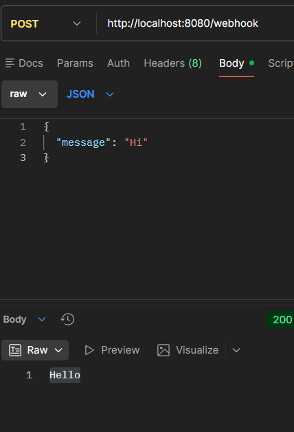
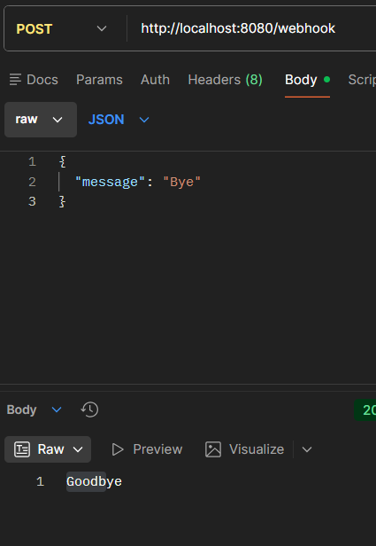
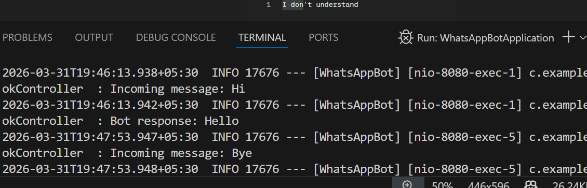

# WhatsApp Chatbot Backend (Spring Boot)

## 📌 Overview

This project is a simple simulation of a WhatsApp chatbot backend built using Spring Boot. It exposes a REST API endpoint that receives messages and responds with predefined replies.

---

## 🚀 Features

* REST API endpoint `/webhook`
* Accepts JSON input
* Returns chatbot responses
* Logs incoming messages and responses
* Handles basic commands like:

  * Hi → Hello
  * Bye → Goodbye

---

## 🛠️ Tech Stack

* Java
* Spring Boot
* Maven

---

## 📡 API Endpoint

### POST /webhook

#### Request:

```json
{
  "message": "Hi"
}
```

#### Response:

```
Hello
```

---

## 🧪 Testing

Tested using Postman.

---

## ▶️ How to Run

1. Clone the repo:

```
git clone https://github.com/YOUR_USERNAME/whatsapp-chatbot-springboot.git
```

2. Navigate to project:

```
cd whatsapp-chatbot-springboot
```

3. Run the application:

```
mvn spring-boot:run
```

4. Access API:

```
http://localhost:8080/webhook
```

---

## 📸 Screenshots







---


